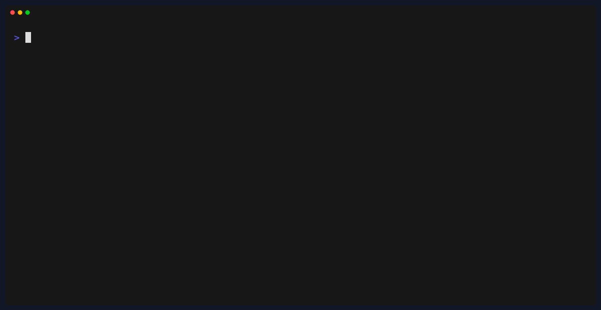
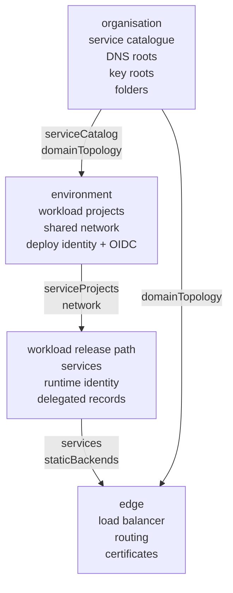

# making-iac-boring

A runnable companion to
[Making IaC boring](https://ruslanakchurin.dev/blog/making-iac-boring/).

The series names the architecture. This repo makes the shape executable with
placeholder infrastructure: four tiers cut along ownership, typed cross-tier
contracts, and resolver probes that fail before any provider call.

[Read the series](https://ruslanakchurin.dev/blog/making-iac-boring/) |
[Run the demo](#run-it) |
[Watch the recordings](#recordings)

No provider SDKs, credentials, live domains, or production configuration are
used. Domains use the reserved `.invalid` suffix, and all names are generic
fixtures.

## Run it

No install is needed for the demo. It uses native TypeScript on Node >= 22.6.

```sh
node demo/run.ts
```

The walkthrough applies the tiers in order, resolves every contract, prints the
resource plan and release waves, then fires the refusal probes.

Prefer text to a terminal? [docs/demo-output.md](docs/demo-output.md) is the
full expected output, captured verbatim.

## Verify it

Install dependencies only when running the repository checks.

```sh
npm ci
npm run check
```

`npm run check` type-checks the code and runs the demo.

## Recordings

Short screen recordings of the walkthrough. For the same content as text, see
[docs/demo-output.md](docs/demo-output.md).

### 1. Shape and ownership



### 2. Contracts and membership


### 3. Refusals before apply


## Shape



## What to look for

- **Ownership cut:** organisation, environment, workload, and edge change for
  different reasons.
- **Contract resolution:** consumers ask for named capabilities such as
  `serviceProjects["workload-api"]` and `network["primary"]`.
- **Membership:** the environment creates the project boundary; the workload
  creates service-owned members inside it.
- **Shared-surface rules:** DNS and secret access need binding rules, not only
  resolved values.
- **Release gates:** failed previews block the deploy path before apply.

## Read the code

| Question | Start here |
| --- | --- |
| What does the full demo do? | `demo/run.ts` |
| Where are the tiers? | `organisation/`, `environment/`, `workloads/`, `edge/` |
| Where do resolver refusals live? | `lib/*/consumer.ts`, `lib/secrets.ts`, `lib/dns/consumer.ts` |
| How does this map to the migration order? | `MIGRATION.md` |
